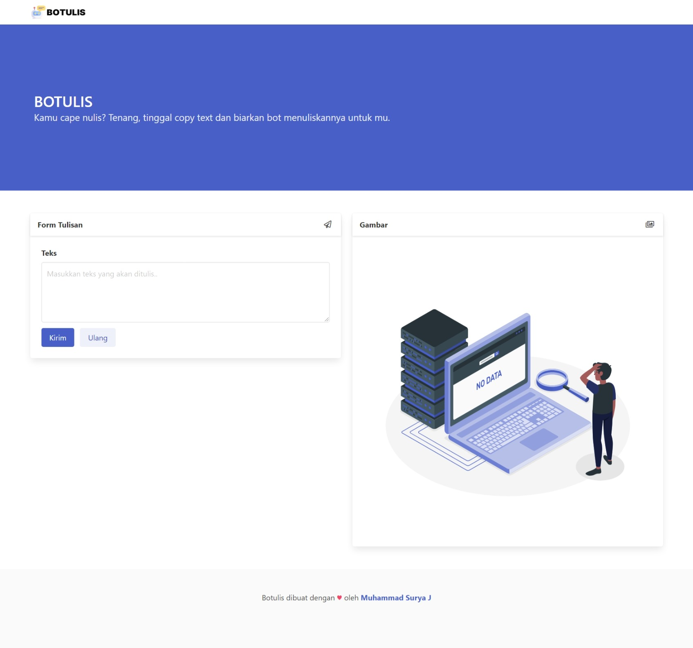

 
  
  &#xa0;

<h1 align="center">Botulis</h1>

  

  

  

  

  

  

  <a href="#dart-tentang">Tentang</a> &#xa0; | &#xa0; 
  <a href="#rocket-teknologi">Teknologi</a> &#xa0; | &#xa0;
  <a href="#memo-lisensi">Lisensi</a> &#xa0; | &#xa0;
  <a href="https://github.com/suryamsj" target="_blank">Author</a>

 

## :dart: Tentang ##

Botulis adalah website untuk menjalankan bot yang bisa menulis dengan maksud untuk membantu kamu dalam menyalin / mencatat agar lebih cepat.

## :rocket: Teknologi ##

Project ini menggunakan:

- [PHP V7.4.14](https://www.php.net/)
- [Bulma](https://bulma.io/)
- [Sweetalert 2](https://sweetalert2.github.io/)
- [Ihsandevs API](https://backend-ihsandevs.herokuapp.com/api/)

## :memo: Lisensi ##

Project ini dibawah lisensi MIT. untuk lebih jelas, bisa lihat [LICENSE](LICENSE.md).

Dibuat dengan :heart: oleh <a href="https://github.com/suryamsj" target="_blank">Muhammad Surya Jayadiprana</a>

## :moneybag: Donasi ##

&#xa0;

<a href="#top">Back to top</a>